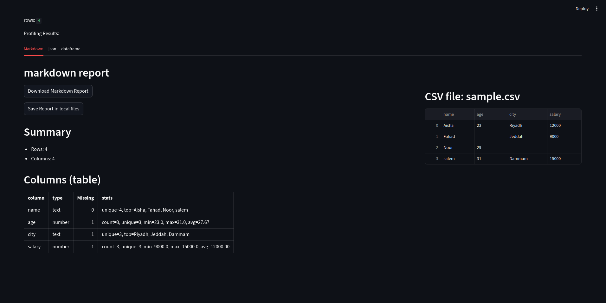

# Bootcamp

## Requirements
- Python 3.9+
- **uv** (Python package & environment manager)

## Installation

### Clone the repository :
```bash
# Clone the repository
git clone https://github.com/khaled0625/bootcamp.git
cd bootcamp
```
#### Create a virtual environment :
```bash
python uv venv 
```
### active the environment linux/mac:
```bash
source .venv/bin/activate 
```
### active the environment Windows:
```bash
.venv/Scripts/activate 
```
install the package:
```bash
install requirements
uv pip install -r requirements.txt
```
## Quick Start
```bash
 cd csv-profiler/src
 uv run python -m csv_profiler.cli profile data/sample.csv # or select the absloute path of the .csv file from any diractor 
 ```

## Output
Generated reports are written to the output/ directory:
-report.json
-report.md

## run streamlet
```bash
cd csv-profiler/src
streamlit run app_profiler.py 
```
## test in Streamlit Community Cloud
#### https://bootcamp-mksgasnbhnhwb2uutmjbsm.streamlit.app/
## Screenshot
